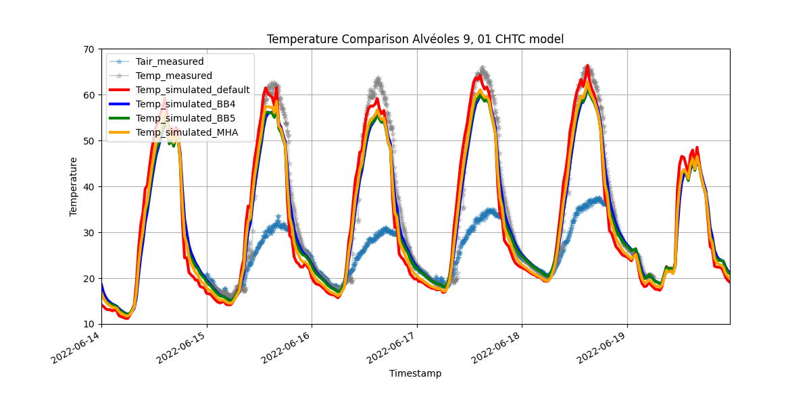

# Plot Styling for Consistent Comparison

This function `plot_comparison` is designed to ensure that all temperature comparison plots follow a unified style, regardless of the underlying data source. The following elements are key to this consistency:

## 1. Figure Size and Y-axis Range
   - The figure size is set to `(12, 6)` to maintain a consistent aspect ratio across all plots. The y-axis limit is set to `[10, 70]` to ensure a uniform temperature range across different experiments, making comparisons easier.

```python
plt.figure(figsize=(12, 6))
plt.ylim([10, 70])
```

## 2. Measured Data Representation**:
   - Measured data (`Tair_measured` and `Temp_measured`) is plotted using `marker='*'` and `alpha=0.3` to differentiate it from simulated data. This ensures the measured data remains visible but not overwhelming.

```python
plt.plot(df1['TIMESTAMP'], df1[f'Temp_{d}'], marker='*', label=f'Temp_measured', alpha=0.3, color='grey')
```
   
## 3. Simulated Data Representation**:
   - Simulated data lines are assigned specific colors (`red`, `blue`, `green`, `orange`) with a thicker `linewidth=3`. This ensures clarity and consistent differentiation between different simulation models. You can name your label anything you want.

```python
plt.plot(df2['TIMESTAMP'], df2[f'Temp_{num_pavement}'], label='Temp_simulated_default', alpha=1.0, color='red', linewidth=3)
plt.plot(df3['TIMESTAMP'], df3[f'Temp_{num_pavement}'], label='Temp_simulated_BB4', alpha=1.0, color='blue', linewidth=3)
plt.plot(df4['TIMESTAMP'], df4[f'Temp_{num_pavement}'], label='Temp_simulated_BB5', alpha=1.0, color='green', linewidth=3)
plt.plot(df5['TIMESTAMP'], df5[f'Temp_{num_pavement}'], label='Temp_simulated_MHA', alpha=1.0, color='orange', linewidth=3)
...
```

## 4. Date Formatting**:
   - The x-axis is formatted with the same date format (`%Y-%m-%d`) across all plots, ensuring consistency in the representation of time.
   - The `autofmt_xdate()` function ensures the date labels are readable and don’t overlap, providing a clean and consistent x-axis presentation.

```python
plt.gca().xaxis.set_major_formatter(plt.matplotlib.dates.DateFormatter('%Y-%m-%d'))
plt.gcf().autofmt_xdate()
```

## 5. Axis Labels**:
   - The x-axis is always labeled as `Timestamp` and the y-axis as `Temperature` to maintain consistent terminology across all plots.

```python
plt.xlabel('Timestamp')
plt.ylabel('Temperature')
```

## 6. Legend and Grid**:
   - A legend is included in every plot to clearly distinguish between different data series.
   - Grid lines are added to improve readability and interpretation of the data.

```python
plt.legend()
plt.grid(True)
```

## Full code example:
```python
def plot_comparison(path):
    # df1, df2, df3, df4, and df5 are already pre-loaded DataFrames containing the data
    df1 = pd.read_csv(path + ...")  # Example for measured data
    df2 = pd.read_csv(path + ...")  # Example for simulated data
    ...

    # Convert TIMESTAMP to datetime in all DataFrames
    df1['TIMESTAMP'] = pd.to_datetime(df1['TIMESTAMP'])
    df2['TIMESTAMP'] = pd.to_datetime(df2['TIMESTAMP'])
    ...

    # Set time range
    min_timestamp = min(df1['TIMESTAMP'].min(), df2['TIMESTAMP'].min())
    max_timestamp = max(df1['TIMESTAMP'].max(), df2['TIMESTAMP'].max())

    # Plot setup
    plt.figure(figsize=(12, 6))
    
    # Plot measured and simulated data
    plt.plot(df1['TIMESTAMP'], df1[f'Temp_{d}'], marker='*', label=f'Temp_measured', alpha=0.3, color='grey') # Measured data
    plt.plot(df2['TIMESTAMP'], df2[f'Temp_{num_pavement}'], label='Temp_simulated_default', alpha=1.0, color='red', linewidth=3) # Simulated data
    # plt.plot(df3['TIMESTAMP'], df3[f'Temp_{num_pavement}'], label='Temp_simulated_BB4', alpha=1.0, color='blue', linewidth=3)
    # plt.plot(df4['TIMESTAMP'], df4[f'Temp_{num_pavement}'], label='Temp_simulated_BB5', alpha=1.0, color='green', linewidth=3)
    # plt.plot(df5['TIMESTAMP'], df5[f'Temp_{num_pavement}'], label='Temp_simulated_MHA', alpha=1.0, color='orange', linewidth=3)

    plt.title('...')
    
    # Set axis labels and limits
    plt.xlabel('Timestamp')
    plt.ylabel('Temperature')
    plt.xlim(min_timestamp, max_timestamp)
    plt.ylim([10, 70]) # It is up to the range of surface temperature

    # Format x-axis as dates
    plt.gca().xaxis.set_major_formatter(plt.matplotlib.dates.DateFormatter('%Y-%m-%d'))
    plt.gcf().autofmt_xdate()

    # Display legend and grid
    plt.legend()
    plt.grid(True)
    plt.show()
```

## Output example:

