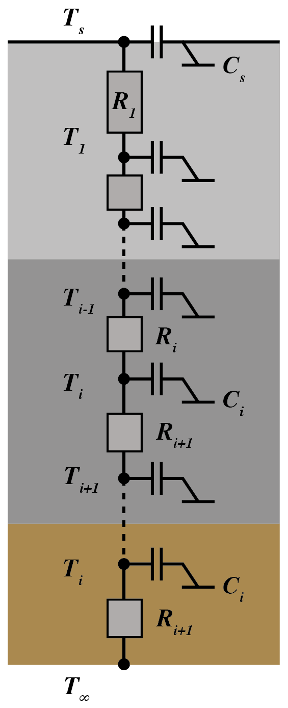

# Conduction Model - SOLENE THERMAL MODEL

SOLENE-Microclimat 模型是耦合了基于SOLENE的辐射、热模型以及Code_Saturne的流体力学模型。根据表面的类型分为不同的热辐射平衡方案：不透水地面、植被地面和建筑物墙壁（这里我们只详细解释不透水地面的情况，只考虑热传递而忽略湿气传递）。另外在此模型是一维的，所以

地面热传导模型采用的是Marie-Hélène Azam开发的土壤模型，她提出的土壤模型是为路面涂层等不透水表面设计的。因此，只考虑热传递（忽略水分传递）。土壤模型是一维的，其中每层都有自己的特性。在非稳定状态下，温度波动是根据方程 (1) 计算的，这是热方程在一维问题中的应用。SOLENE中的热传导的核心是使用电类比的隐式差分形式来求解。热阻代表了通过地面层的热传递阻力，热容代表了地面层的热存储能力，如图1所示。土壤模型由n个节点组成。

The general heat conduction equation in soil can be written as:

$$
\frac{\partial T}{\partial t} = \alpha_{\text{soil}} \frac{\partial^2 T}{\partial x^2}
$$

Where:

- $T$ is the temperature $[K]$.
- $t$ is the time $[s]$.
- $x$ is the spatial coordinate $[m]$.
- $\alpha_{\text{soil}}$ is the thermal diffusivity of the soil $[m^2/s]$.

将土壤分解为n层，我们可以分3种情况考虑，包括：（1）土壤与空气接触的边界条件；（2）土壤内部节点 $i$；（3）深层土壤的边界条件。

  

<b>Figure 1: Schematic representation of the soil model.</b>

## Conduction model methodology
### Nomenclature
- $C_s$ is the surface layer heat capacity $[J/m^2K]$.
- $T_s$ is the surface temperature $[K]$.
- $T_1$ is the temperature at the first node beneath the surface $[K]$.
- $T_a$ is the air temperature $[K]$.
- $R_c$ is defined as $R_c = \frac{1}{h_c}$, where $h_c$ is the convective heat transfer coefficient.
- $R_1$ is the heat resistance between the surface and the first node $[K/W]$.
- $R_{\text{net}}$ is the net radiation $[W/m^2]$.
- $LE$ is the latent heat flux $[W/m^2]$.
- $C_i$ is the heat capacity of the layer at the node $i$ $[J/m^2K]$.
- $T_i$ is the temperature of the node $i$ $[K]$.
- $R_i$ is the heat resistance of the layer between the node $i-1$ and $i$ $[K/W]$.
- $T_{\infty}$ is the deep soil temperature $[K]$.

### Implicit Finite Element Discretization for the Soil Model

We consider the soil model divided into \(n\) layers, and we solve the heat conduction problem using the implicit finite element method (FEM). The model consists of three parts:

1. Surface boundary condition (soil-air interface),
2. Internal nodes,
3. Deep soil boundary condition.

#### 1 Surface Boundary Condition (Soil-Air Interface)

At the surface node ($i = 0$), the energy balance equation accounts for latent heat, radiation, and conduction between the surface and the first layer beneath it:

$$
C_s \frac{dT_s}{dt} + \frac{T_s - T_a}{R_c} + \frac{T_s - T_1}{R_1} = R_{\text{net}} - L E
$$

In matrix form, this equation can be discretized using the implicit time-stepping method. Assuming $T_s^t$ is the temperature at the current time step and $T_s^{t+1}$ is at the next time step:

$$
C_s \frac{T_s^{t+1} - T_s^t}{\Delta t} + \frac{T_s^{t+1} - T_a^{t+1}}{R_c} + \frac{T_s^{t+1} - T_1^{t+1}}{R_1} = R_{\text{net}} - L E
$$

This forms part of the matrix system where $T_s^{t+1}$ depends on the surface and the first internal node.

#### 2 Internal Nodes

For internal nodes $i$, the energy balance equation is:

$$
C_i \frac{dT_i}{dt} + \frac{T_i - T_{\text{i+1}}}{R_{\text{i+1}}} - \frac{T_{\text{i-1}} - T_i}{R_i} = 0
$$

Using the implicit method, this can be written as:

$$
C_i \frac{T_i^{t+1} - T_i^t}{\Delta t} + \frac{T_i^{t+1} - T_{\text{i+1}}^{t+1}}{R_{\text{i+1}}} - \frac{T_{\text{i-1}}^{t+1} - T_i^{t+1}}{R_i} = 0
$$

#### 3 Deep Soil Boundary Condition

At the deep soil boundary, the temperature is assumed to approach a constant $T_{\infty}$. The energy balance equation at the bottom node is:

$$
C_i \frac{dT_i}{dt} + \frac{T_i - T_{\infty}}{R_{\text{i+1}}} - \frac{T_{\text{i-1}} - T_i}{R_i} = 0
$$

In implicit form:

$$
C_i \frac{T_i^{t+1} - T_i^t}{\Delta t} + \frac{T_i^{t+1} - T_{\infty}}{R_{\text{i+1}}} - \frac{T_{\text{i-1}}^{t+1} - T_i^{t+1}}{R_i} = 0
$$

### Assembling the Matrix System

The soil model with $n$ layers forms a system of equations that can be written in matrix form as:

$$
\mathbf{A} \mathbf{T}^{t+1} = \mathbf{B}
$$

Where:

- $\mathbf{A}$ represents the system's coefficient matrix,
- $\mathbf{T}^{t+1}$ is the unknown temperature vector at the next time step $t+1$,
- $\mathbf{B}$ is a combination of known values, including constant terms and contributions from the previous time step $n$.

For impermeable soil, between the time steps $[t]$ and $[t+1]$ the matrix system is written:

$$
\left[
\begin{matrix}
\frac{C_s}{\Delta t} + \frac{1}{R_c} + \frac{1}{R_1} & -\frac{1}{R_1} & 0 & \cdots & 0 \\\\
-\frac{1}{R_1} & \frac{C_1}{\Delta t} + \frac{1}{R_1} + \frac{1}{R_2} & -\frac{1}{R_2} & \cdots & 0 \\\\
0 & -\frac{1}{R_2} & \frac{C_2}{\Delta t}+ \frac{1}{R_2} + \frac{1}{R_3} & \cdots & 0 \\\\
\vdots & \vdots & \vdots & \ddots & \vdots \\\\
0 & \cdots & 0 & -\frac{1}{R_n} & \frac{C_n}{\Delta t} + \frac{1}{R_n} \\\\
\end{matrix}
\right]
\times
\left[
\begin{matrix}
T_s^{t+1} \\\\
T_1^{t+1} \\\\
T_2^{t+1} \\\\
\vdots \\\\
T_n^{t+1} \\\\
\end{matrix}
\right]
\quad \text{=} \quad
\left[
\begin{matrix}
\frac{C_s}{\Delta t} T_s^t + R_{\text{net}} - LE + \frac{T_a}{R_c} \\\\
\frac{C_1}{\Delta t} T_1^t \\\\
\frac{C_2}{\Delta t} T_2^t \\\\
\vdots \\\\
\frac{C_i}{\Delta t} T_i^t - \frac{T_{\infty}}{R_{\text{i+1}}} \\\\
\end{matrix}
\right]
$$

### Deep boundary condition
In deep soil, the temperature is assumed to remain constant over the course of a day. For homogeneous soil, an analytical solution can be used to calculate the temperature at any depth if the surface temperature is considered to be sinusoidal. The parameters $T_{\text{ma}}$, $A_a$ and $t_0$ are respectively the mean, the amplitude, and the phase of a day surface temperature signal:

$$
T(z,t) = T_{\text{ma}} + A_a \cdot exp\left[-\frac{z}{zd_a}\right]sin\left[w_a(t-t_0)-\frac{z}{zd_a}\right]
$$

Where,
- $T_{\text{ma}}$ is mean annual temperature $[°C]$.
- $A_a$ is annual half amplitude of the climatic thermal wave at the surface $[°C]$.
- $zd_a$ is damping depth with an annual beat, $z_d = \sqrt{\frac{2 \alpha_{\text{sol}}}{w_a}}$ $[m]$.
- $w_a$ is annual beat $w_a = 2 \cdot \pi / 365$ $[rad \cdot day^-1]$.
- $t$ is day of year number (1 to 365).
- $t_0$ is day of the year where the surface temperature was the coldest.
- $\alpha_{\text{sol}}$ is thermal diffusivity of the sol $[m^2/s]$

The thermal diffusivity is calculated using the following formula:

$$
\alpha_{\text{sol\_eq}} = \frac{\lambda_{\text{sol\_eq}}}{\rho_{\text{sol\_eq}} \cdot C_{p_{\text{sol\_eq}}}} \cdot 24 \cdot 3600
$$

Where:
$T_{\text{ma}}$
$\lambda$
- $\lambda_{\text{sol\_eq}}$ is the equivalent thermal conductivity.
- $\rho_{\text{sol\_eq}}$ is the equivalent soil density.
- $C_{p_{\text{sol\_eq}}}$ is the equivalent specific heat capacity.
- The multiplication by $24 \cdot 3600$ converts the thermal diffusivity into units of square meters per day.
